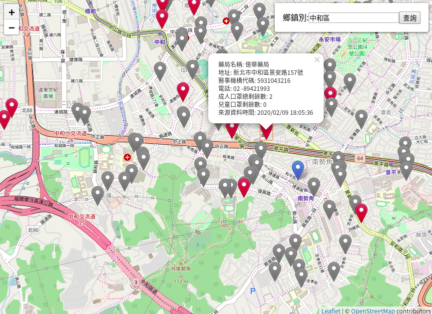

## 特約藥局配送口罩地圖
### [Demo](https://moved0311.github.io/pharmacy-mask-map/)

## Reference
#### map library
* [Esri Leaflet](https://esri.github.io/esri-leaflet/)
#### place
* [L.esri.Geocoding.GeocodeService](http://esri.github.io/esri-leaflet/api-reference/services/geocode-service.html#methods)
* [L.esri.Geocoding.Geocode](http://esri.github.io/esri-leaflet/api-reference/tasks/geocode.html)
#### query
* [Querying features](https://esri.github.io/esri-leaflet/examples/querying-feature-layers-1.html)
#### real time data 
* [kiang/pharmacies/json](https://github.com/kiang/pharmacies/tree/master/json)
#### color marker
* [leaflet-color-markers](https://github.com/pointhi/leaflet-color-markers)
